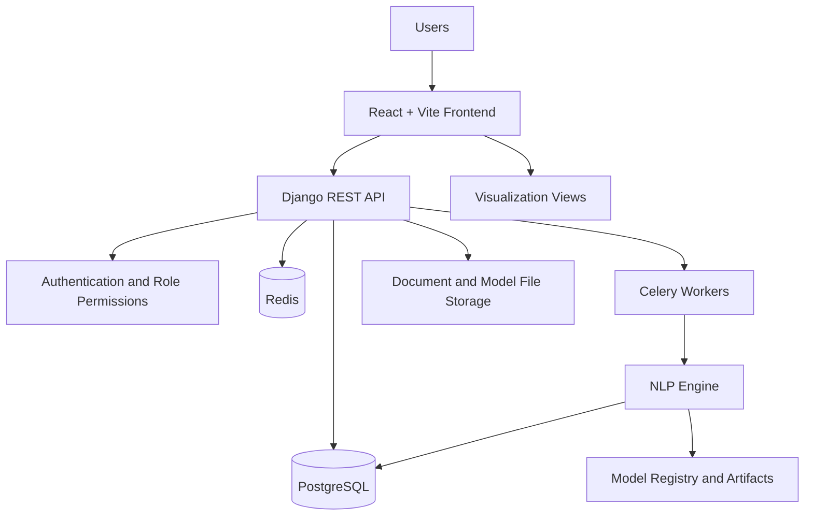
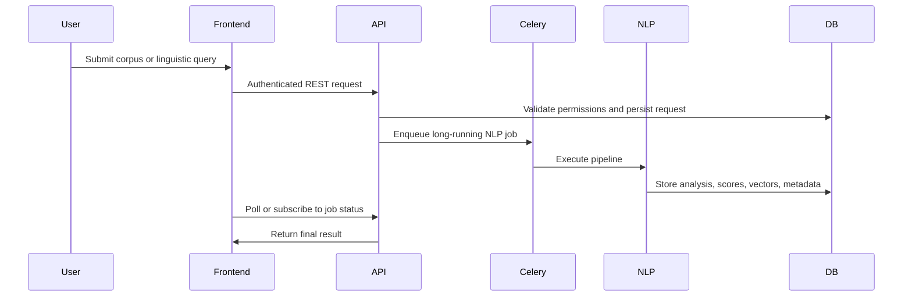
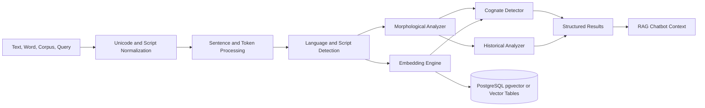
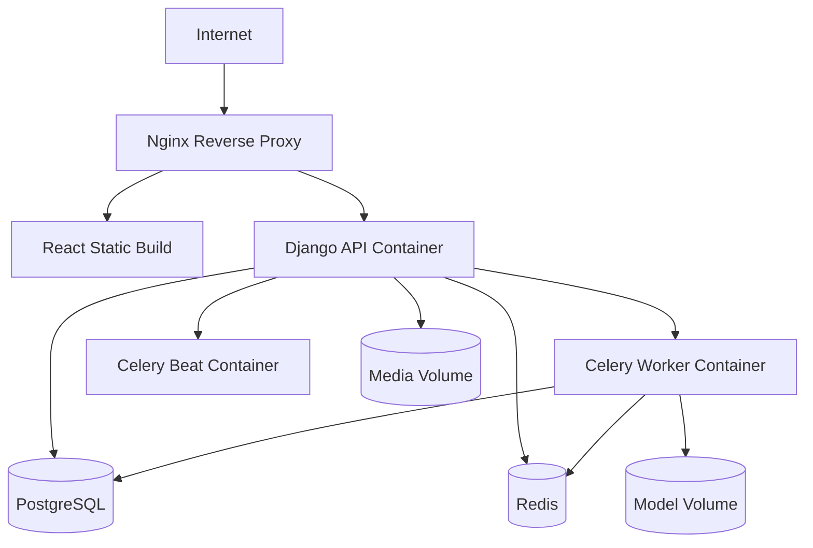

# TurkicGrammarAI Architecture

## 1. Purpose

TurkicGrammarAI is a production-oriented AI platform for comparative-historical Turkic linguistics. It supports corpus management, language metadata, morphology analysis, cognate detection, historical grammar comparison, multilingual embeddings, AI-assisted research chat, analytics, and visualization.

## 2. Technology Stack

### Backend

- Python 3.12
- Django 5
- Django REST Framework
- PostgreSQL
- Celery
- Redis
- Docker

### Frontend

- React
- Vite
- Bootstrap 5
- Axios
- React Router

### AI/NLP

- PyTorch
- Transformers
- Sentence Transformers
- FastText
- XLM-R
- mBERT
- LaBSE

## 3. Repository Structure

```text
TurkicGrammarAI/
  ARCHITECTURE.md
  DATABASE_DESIGN.md
  API_SPECIFICATION.md
  ROADMAP.md
  backend/
    config/
      settings/
      urls.py
      asgi.py
      wsgi.py
      celery.py
    core/
      permissions/
      pagination/
      exceptions/
      responses/
      validators/
      storage/
    apps/
      accounts/
      languages/
      corpus/
      morphology/
      cognates/
      historical/
      embeddings/
      chatbot/
      analytics/
      visualization/
    nlp/
      pipelines/
      models/
      services/
      evaluation/
      preprocessing/
    tasks/
      corpus_tasks/
      embedding_tasks/
      model_tasks/
  frontend/
    src/
      pages/
      components/
      layouts/
      services/
      hooks/
      store/
      routes/
      assets/
  infra/
    docker/
    nginx/
    postgres/
    redis/
    celery/
  docs/
```

## 4. Backend Module Architecture

| Module | Responsibility |
| --- | --- |
| `accounts` | Users, authentication, roles, profiles, audit metadata |
| `languages` | Turkic language records, scripts, dialects, families, phoneme inventories |
| `corpus` | Corpus documents, tokens, sentences, uploads, search indexes, annotations |

### Corpus Layer

The `corpus` app provides end-to-end corpus management and preprocessing required for large-scale embedding training and retrieval:

- Ingestion: multi-format importers (TXT/JSON/CSV/XML), `CorpusSource` provenance, and `CorpusDocument` storage.
- Deduplication: document and sentence checksumming and duplicate removal engine.
- Normalization: Unicode normalization, punctuation/whitespace cleanup, and language-specific hooks.
- Segmentation: sentence splitting producing `CorpusSentence` records.
- Tokenization: token extraction producing `CorpusToken` records.
- Statistics: aggregated counts accessible via `GET /api/corpus/statistics/`.
- Management commands: `import_corpus`, `normalize_corpus`, `build_sentences`, `build_tokens` for batch operations.
- Admin: model registration for manual inspection and lightweight curation.

The corpus layer is intentionally lightweight and modular to allow later replacement with language-specific NLP pipelines, and to avoid training models during ingestion (per project constraints).

### Cognates Layer

The `cognates` app implements comparative-historical cognate management:

- `CognateSet`: grouping of cognate entries with an optional reconstructed `proto_form` and metadata.
- `CognateEntry`: language-specific attested forms (word, lemma, IPA, meaning, provenance).
- Import: bulk seeding from `backend/data/cognates/cognates.json`, idempotent and transactional.
- Services: comparative search, statistics aggregation, export to JSON/CSV.
- API: list/retrieve/search/statistics endpoints under `/api/cognates/`.

The cognates layer intentionally does not perform embedding training or heavy ML during import; it prepares structured, deduplicated, and queryable cognate data for downstream embedding or model training.

| `morphology` | Lemmas, stems, affixes, paradigms, morphological analyses |
| `cognates` | Cognate sets, pairwise similarity, sound correspondences, confidence scores |
| `historical` | Proto forms, historical periods, grammar rules, diachronic transformations |
| `embeddings` | Embedding jobs, vector spaces, model registry, semantic similarity |
| `chatbot` | Research assistant sessions, messages, retrieval context, citations |
| `analytics` | Usage metrics, corpus statistics, model performance, research activity |
| `visualization` | Similarity matrices, language trees, graph exports, embedding projections |

## 5. Frontend Module Architecture

```text
frontend/src/
  pages/
    DashboardPage
    LoginPage
    RegisterPage
    LanguagesPage
    CorpusPage
    MorphologyPage
    CognatesPage
    HistoricalPage
    EmbeddingsPage
    ChatbotPage
    AnalyticsPage
    VisualizationPage
  components/
    auth/
    language/
    corpus/
    morphology/
    cognates/
    historical/
    embeddings/
    chatbot/
    charts/
    common/
  layouts/
    AuthLayout
    DashboardLayout
    ResearchLayout
  services/
    apiClient
    authService
    languageService
    corpusService
    nlpService
  hooks/
    useAuth
    usePermissions
    useDebouncedSearch
    useAsyncJob
  store/
    authStore
    uiStore
    researchStore
  routes/
    AppRouter
    ProtectedRoute
    RoleRoute
  assets/
    images/
    icons/
    styles/
```

## 6. System Diagram



## 7. Request Flow



## 8. Authentication Architecture

The platform uses token-based authentication with short-lived access tokens and refresh tokens. Django owns identity, role assignment, permissions, and audit events. DRF permission classes enforce module-level and object-level access.

### Roles

| Role | Access Level |
| --- | --- |
| Super Admin | Full platform administration, user management, model registry, all data |
| Researcher | Create and manage research datasets, run NLP analyses, export results |
| Student | Read approved learning datasets, run limited analyses, use chatbot and examples |

### Permission Model

- Global role permissions define broad capability.
- Object permissions restrict ownership-sensitive resources such as private corpora.
- Audit logs track authentication, data uploads, model runs, exports, and admin changes.

## 9. AI Pipeline Architecture



### Pipeline Layers

| Layer | Responsibility |
| --- | --- |
| Preprocessing | Unicode normalization, transliteration, sentence splitting, tokenization |
| Linguistic Analysis | POS tagging, lemma detection, suffix segmentation, feature extraction |
| Comparative Analysis | Cognate candidates, phonetic similarity, semantic similarity |
| Historical Analysis | Sound changes, proto-form comparison, diachronic rules |
| Embedding Layer | FastText, mBERT, XLM-R, LaBSE vector generation |
| Chatbot Layer | Retrieval-augmented answers grounded in corpus and grammar data |

## 10. Deployment Architecture



## 11. Docker Architecture

| Service | Purpose |
| --- | --- |
| `frontend` | Builds Vite React app and serves static assets through Nginx |
| `backend` | Django REST API, admin, authentication, synchronous requests |
| `worker` | Celery worker for corpus ingestion, AI jobs, embeddings, reports |
| `beat` | Celery scheduler for periodic maintenance and analytics |
| `postgres` | Relational database and optional vector extension |
| `redis` | Celery broker, result backend, short-lived cache |
| `nginx` | TLS termination, reverse proxy, static and media routing |

## 12. Production Concerns

- Separate local, staging, and production settings.
- Use environment variables for secrets and service URLs.
- Enforce HTTPS, secure cookies, CORS allowlists, CSRF policy, and rate limits.
- Add database backups and model artifact versioning.
- Monitor API latency, job queues, model errors, failed logins, and storage growth.
- Use idempotent Celery jobs for large corpus and embedding workloads.
