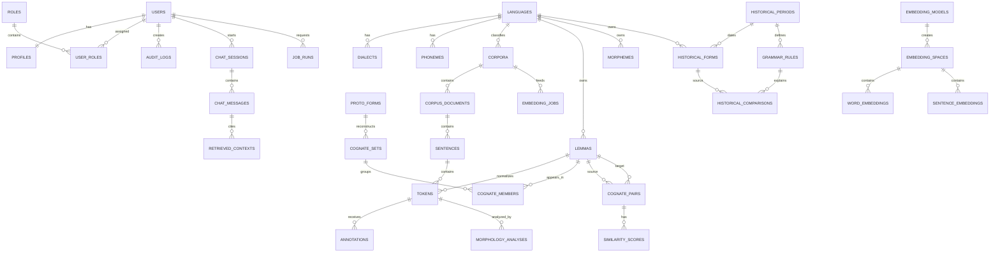

# TurkicGrammarAI Database Design

## 1. Database Strategy

PostgreSQL is the primary system of record. The schema is normalized around language data, corpora, linguistic analyses, AI jobs, and user activity. Vector search can be implemented with PostgreSQL `pgvector` or a dedicated vector table strategy if extension support is unavailable.

## 2. Core Entity Groups

| Group | Main Tables |
| --- | --- |
| Identity | users, roles, user_roles, profiles, audit_logs |
| Languages | languages, scripts, dialects, phonemes, sound_correspondences |
| Corpus | corpora, corpus_documents, sentences, tokens, annotations |
| Morphology | lemmas, morphemes, affixes, paradigms, morphology_analyses |
| Cognates | cognate_sets, cognate_members, cognate_pairs, similarity_scores |
| Historical | historical_periods, historical_forms, proto_forms, grammar_rules |
| Embeddings | embedding_models, embedding_spaces, word_embeddings, sentence_embeddings |
| Chatbot | chat_sessions, chat_messages, retrieved_contexts |
| Analytics | usage_events, job_runs, model_metrics, exports |
| Visualization | saved_views, graph_nodes, graph_edges |

## 3. Primary Tables

### Identity

| Table | Fields |
| --- | --- |
| `users` | id, email, password_hash, first_name, last_name, is_active, is_staff, date_joined |
| `roles` | id, name, description |
| `user_roles` | id, user_id, role_id, assigned_by_id, assigned_at |
| `profiles` | id, user_id, institution, research_area, preferred_language, avatar |
| `audit_logs` | id, user_id, action, resource_type, resource_id, ip_address, metadata, created_at |

### Languages

| Table | Fields |
| --- | --- |
| `languages` | id, name, native_name, iso_code, family_branch, status, description |
| `scripts` | id, name, code, direction |
| `language_scripts` | id, language_id, script_id, is_primary |
| `dialects` | id, language_id, name, region, notes |
| `phonemes` | id, language_id, symbol, ipa, phoneme_type, features |
| `sound_correspondences` | id, source_language_id, target_language_id, source_sound, target_sound, context, confidence |

### Corpus

| Table | Fields |
| --- | --- |
| `corpora` | id, title, language_id, owner_id, visibility, license, description |
| `corpus_documents` | id, corpus_id, title, source_type, file_path, raw_text, metadata, status |
| `sentences` | id, document_id, text, normalized_text, position, language_id |
| `tokens` | id, sentence_id, language_id, surface, normalized, lemma_id, position |
| `annotations` | id, token_id, annotator_id, label, value, confidence, source |

### Morphology

| Table | Fields |
| --- | --- |
| `lemmas` | id, language_id, text, normalized, pos, gloss |
| `morphemes` | id, language_id, form, morpheme_type, gloss, features |
| `affixes` | id, language_id, form, affix_type, function, examples |
| `paradigms` | id, language_id, name, pos, description |
| `paradigm_slots` | id, paradigm_id, name, features, ordering |
| `morphology_analyses` | id, token_id, analyzer_version, segmentation, features, confidence |

### Cognates

| Table | Fields |
| --- | --- |
| `cognate_sets` | id, label, proto_form_id, meaning, confidence, notes |
| `cognate_members` | id, cognate_set_id, lemma_id, language_id, form, notes |
| `cognate_pairs` | id, source_lemma_id, target_lemma_id, method, similarity, confidence |
| `similarity_scores` | id, pair_id, metric, score, model_version |

### Historical Grammar

| Table | Fields |
| --- | --- |
| `historical_periods` | id, name, start_year, end_year, description |
| `proto_forms` | id, reconstructed_form, proto_language, meaning, confidence, source |
| `historical_forms` | id, language_id, period_id, modern_lemma_id, form, transliteration, meaning |
| `grammar_rules` | id, language_id, period_id, rule_type, pattern, replacement, context, description |
| `historical_comparisons` | id, source_form_id, target_form_id, rule_id, explanation, confidence |

### Embeddings

| Table | Fields |
| --- | --- |
| `embedding_models` | id, name, model_type, provider, version, dimension, artifact_path |
| `embedding_spaces` | id, model_id, language_id, corpus_id, name, status |
| `word_embeddings` | id, embedding_space_id, lemma_id, token_text, vector, metadata |
| `sentence_embeddings` | id, embedding_space_id, sentence_id, vector, metadata |
| `embedding_jobs` | id, model_id, corpus_id, requested_by_id, status, started_at, finished_at |

### Chatbot and Jobs

| Table | Fields |
| --- | --- |
| `chat_sessions` | id, user_id, title, created_at, updated_at |
| `chat_messages` | id, session_id, role, content, metadata, created_at |
| `retrieved_contexts` | id, message_id, resource_type, resource_id, score, snippet |
| `job_runs` | id, job_type, status, requested_by_id, input_ref, output_ref, error, created_at |
| `model_metrics` | id, model_id, task, metric_name, metric_value, dataset_ref, created_at |

## 4. ER Diagram

## 5. Indexing Strategy

- Unique index on `users.email`.
- Unique index on `languages.iso_code`.
- Full-text index on `corpus_documents.raw_text`, `sentences.normalized_text`, and `tokens.normalized`.
- Composite indexes on `(language_id, normalized)` for lemmas and tokens.
- Composite indexes on `(source_lemma_id, target_lemma_id)` for cognate pairs.
- Vector index on embedding vector fields when `pgvector` is enabled.
- Timestamp indexes on `audit_logs.created_at`, `job_runs.created_at`, and `chat_messages.created_at`.

## 6. Data Governance

- Public, institution, private, and classroom visibility levels for corpora.
- Soft deletion for user-generated research assets.
- Immutable audit logs.
- Versioned model outputs through `model_version`, `analyzer_version`, and job metadata.
- Explicit licensing metadata for uploaded corpora.
